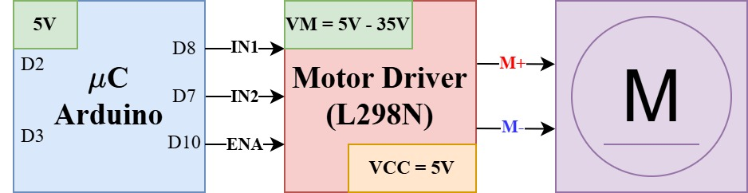

# DCMotorDriver Library for Arduino and ESP32

## Overview

The DCMotorDriver library provides an easy-to-use interface for controlling DC motors using motor drivers such as the ***L298N***. It allows for motor initialization, direction control, speed control, and stopping the motor. The library is designed to be extendable to other motor drivers.

Experimental library. Minimal tested, so usage remarks and comments are welcome.

## Features

- Initialize motor control pins.
- Control motor direction and speed using PWM.
- Stop the motor with a single method call.
- Lightweight and easy to integrate into Arduino projects.

## Installation

1. Copy the `DCMotorDriver.h` and `DCMotorDriver.cpp` files into your Arduino project's `lib/DCMotorDriver/` directory if you are using PlatformIO in VS Code.
2. If you are using the Arduino IDE, copy the files to your Arduino libraries folder (e.g., `C:\Users\<YourUsername>\Documents\Arduino\libraries\DCMotorDriver_dff\`).
3. Alternatively, clone the repository directly into your libraries folder using the following command:

   ```bash
   git clone https://github.com/bulb-light/DCMotorDriver_dff.git <path_to_libraries_folder>
   ```
4. Include the library in your project using `#include <DCMotorDriver.h>`.

## API Reference

### Constructor

```cpp
DCMotorDriver(uint8_t pin1, uint8_t pin2, uint8_t pwmPin);
```
- `pin1`: The first control pin for the motor.
- `pin2`: The second control pin for the motor.
- `pwmPin`: The PWM pin for controlling motor speed.

### Methods

#### `void motorInit()`
Initializes the motor control pins as outputs.

#### `void moveMotor(bool pin1State, bool pin2State, uint8_t pwm)`
Controls the motor's direction and speed.

- `pin1State`: State of the first control pin (HIGH/LOW).
- `pin2State`: State of the second control pin (HIGH/LOW).
- `pwm`: PWM value for speed control (0-255).

#### `void stop()`
Stops the motor by setting all control pins to LOW.

## Example Usage

Below is an example of using the DCMotorDriver library to control a DC motor:

```cpp
#include <Arduino.h>
#include <DCMotorDriver.h>

// change as needed
#define IN1 8
#define IN2 7
#define ENA 10

DCMotorDriver myMotor(IN1, IN2, ENA);

void setup() {
    myMotor.motorInit();
    myMotor.moveMotor(HIGH, LOW, 200); // Move forward with PWM 200
}

void loop() {
    delay(1000);
    myMotor.stop(); // Stop the motor
    delay(1000);
}
```

### Diagram

Refer to the following diagram for the wiring connections:

<p align="center">

</p>

## License

This library is open-source and available under the MIT License.


---

## 📫 How to Reach Me

| Platform | Handle / Link |
|---|---|
| Email | davidcs.ee.10@gmail.com |
| LinkedIn | [david](https://www.linkedin.com/in/davidcsee/) |
| Tiktok | [david_dff_bulblight](https://www.tiktok.com/@david_dff_bulblight)|
| YouTube| [david-dff](https://www.youtube.com/@david-dff-bulblight)|

---

## 🔗 Connect & Collaborate

I’m open to collaboration on open source, side projects, or mentoring.  
Feel free to reach out!

If you appreciate my work, you can support its development and maintenance. Improve the quality of the libraries by providing issues and Pull Requests, or make a donation.

Thank you.
